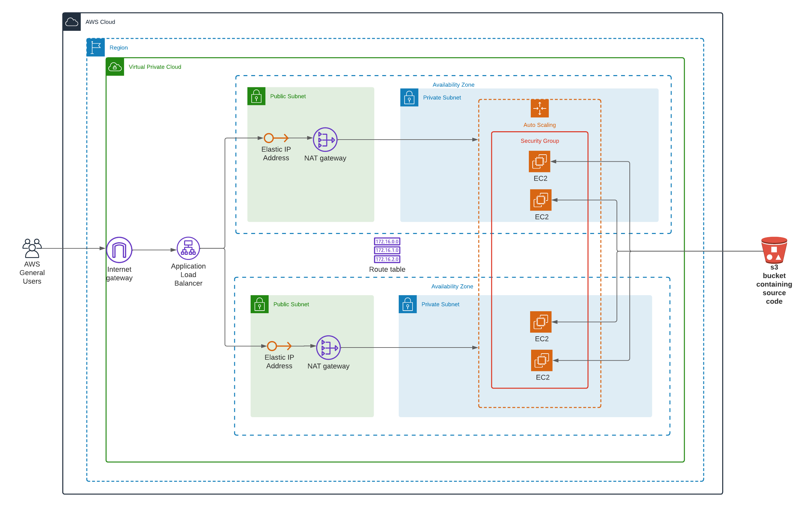

# Deploy a high availability web app using cloudformation



## Introduction

In this project, we will deploy web servers for a highly available web app using CloudFormation. We will write the code that creates and deploys the infrastructure and application for an Instagram-like app from the ground up. We will begin with deploying the networking components, followed by servers, security roles and software.


## Instructions

### How to run?
You can run in two easy steps:
```bash
# Ensure that the AWS CLI is configured before runniing the command below
# Create the network infrastructure
# Check the region in the create.sh file
./create.sh myFirstStack network.yml network-parameters.json
# Create servers
# Change the AMI ID and key-pair name in the servers.yml
# Check the region in the update.sh file
./update.sh mySecStack servers.yml server-parameters.json
```